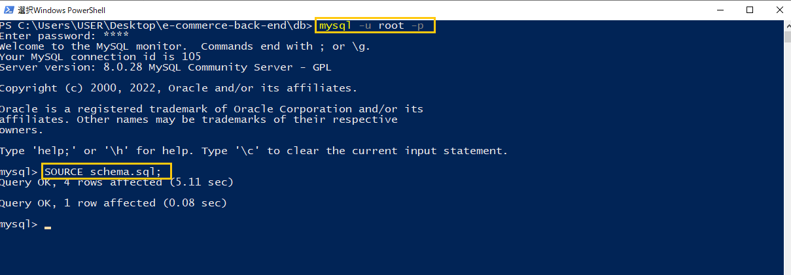
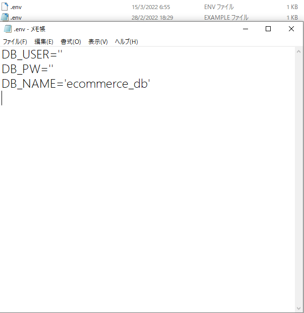
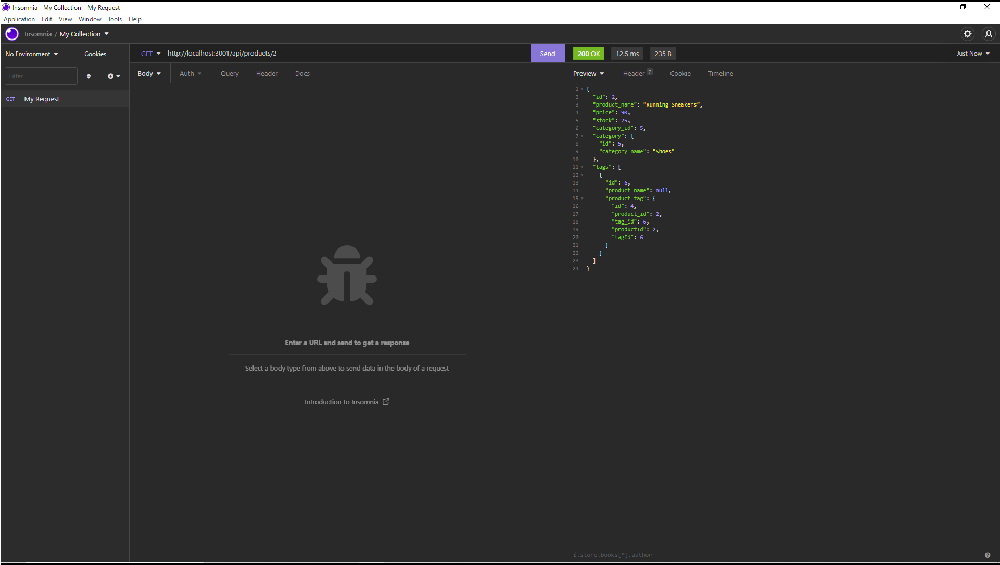
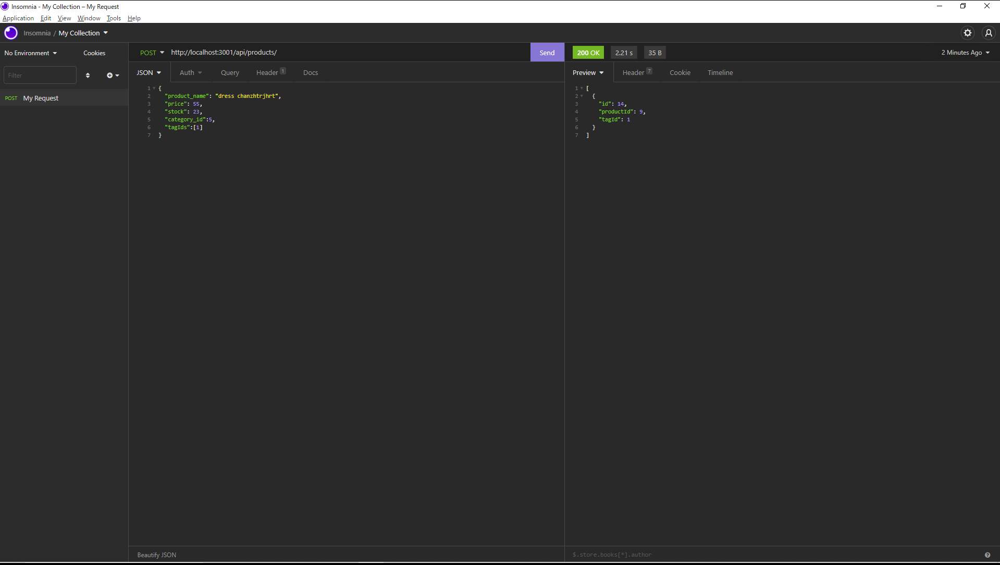
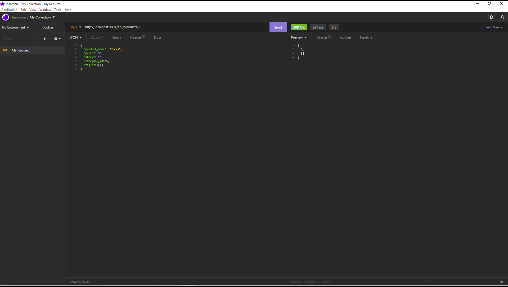

# E-commerce Back End

## Table of Content: 
* [Deploy link](#Deploy-link)
* [Description](#Description)
* [Installation](#Installation)
* [REST](#rest)
* [Initialization Guide](#Initialization-Guide)
* [User Guide](#User-Guide)
* [Third Party Package](#Third-party-package-used)
* [Screenshot](#Screenshot)
* [Video Demo](#Video-demo)

## Deploy Link
https://github.com/Aurorachama/

## Description 

This is a e-commerce site and its database (using mySQL) created by Express.js and SQL with Sequelize used as a interaction to MySQL (dialect for the SQL query).

## Installation 
### This application requires node.js and mysql
**MySQL will be used as the sql management system also known as dialect for the SQL query. Please install node.js before using this application**

***For information about MySQL : [Installation guide for MySQL](https://dev.mysql.com/doc/refman/8.0/en/installing.html)*** <br> <br>

***This application also relies on node.js as its run-time enviornment. Please install node.js before using this application***

***For information about node.js : [Node.js](https://nodejs.org/)***
* Clone this project using git clone <url> or Download ZIP, then use a command line to  run ``` npm i ``` to install necessary packages (inquirer)
---
<br>
<br>

## REST
**Despite this project is usind Express.js, thus somewhat indicates that this is based on a HTTP structure,** <br>
**Although using Web Browser can perform HTTP Get Request, as there are not structured HTML element in this project to perform other request such as POST, DELETE, PUT request (which plays a important part of the project). It is recommended to use some form of REST client. `Insomnia` will be used as the prefered and demostration REST client for this project**

**For information about Insomnia : [Insomnia](https://insomnia.rest/)**

**For information about REST : [REST](https://developer.mozilla.org/en-US/docs/Glossary/REST)**

<br>

---
## Initialization Guide
**Before using the application, initialization of database and connection is critical**

**MySQL Initialization**

[Installation guide for MySQL](https://dev.mysql.com/doc/refman/8.0/en/installing.html)

`After completion of installing MySQL and creating users, it is essential to initialize the database`

* Visit the subfolder 'db', open up a terminal (commend line interface). Type in 
```
mysql -u [replace with username] -p
```
<br>

* Then, enter the password for this user. After that, type in
```
SOURCE schema.sql;
```

`Alternatively, If you start from main folder, type`
``` 
SOURCE db/schema.sql;
```

* This will create a new SQL database named 'ecommerce_db'. `Be ware that Schema.sql will drop (delete) existing database named 'ecommerce_db' before creating a new one, please double-check and backup if you have existing database named using the same name`

* You can rename the database name however you like by changing the 'ecommerce_db' field in `schema.sql` and `.env` file

---
### End goal of MySQL Initialization

* `the code you require to type is in brown branket` (You can restart at anypoint if you have done a mistake)

<br>
<br>

**.env file Initialization**

```
The second initialization is .env, .env is used to store your user credential and used to connect to the database by javascript so it is important to do so
```
* Go back to the root folder, you can see a file named `.env.EXAMPLE`

* You can choose any `text(.txt) editor` as program to open the `.env.EXAMPLE` file. Example would be `Notepad` (Included for Windows), `TextEdit` (Included for MacOS) or any Third party one like `Notepad++`

* This file is the format of the env file you would want to create

* You should change the `DB_USER` and `DB_PASSWORD` as the credential you use to login to MySQL

* You can either rename the file as .env or
* create a text file, Copy .env.EXAMPLE and save it new as a .env file
* **.env is the extension name of the file, if the text editor ask you about the extension of the file, leave it or `choose any file type in Notepad`**
---
### End goal of .env Initialization


---
---

**seeds file Initialization**
* Inside `seeds` folder is some sample data for the database, you can choice to insert them the your database or start from scratch. 
* If you want to use sample data, type **node seeds/index.js** as you are initializing the database

### End goal of .seeds Initialization


---

**Initialization is done! You do not have to repeat the steps above unless you are re-deploying or changing user**
<br>
<br>
<br>
## User Guide
User then can type 
``` 
node server.js
```
or 
``` 
npm start
```
to run the code. 

* Then, you can access the application by http://localhost:3001 (3001 or other port otherwise specify in .env file)

* Breakpoint or Routes includes:
```
/api/products (http://localhost:3001/api/products) for enquiring product related information

/api/categories (http://localhost:3001/api/products) for enquiring category related information (associated product details will also be included as a part of GET Response(json only))

/api/tags (http://localhost:3001/api/products) for enquiring tag related information (associated product details will also be included as a part of GET Response(json only))
```

* Request & Response type for each endpoint

**Although there are three categories of endpoint, each endpoint have the same set of function Request & Response type**

```
GET request
    Get All the information of the category of endpoint (with its assoicated information as response)

GET request by id (eg: GET: api/products/1)
    Get the specific item matched with the id at the category of endpoint (with its assoicated information as response)

POST request
    Creates a new item at the category of endpoint with the information detailed in the request json

PUT request by id (eg: PUT: api/products/1)
    Updates the specific item matched with the id at the category of endpoint with the information detailed in the request json

DELETE request by id (eg: DELETE: api/products/1)
    Delete the specific item matched with the id at the category of endpoint
```

* Here is a photo of every coloumn in every set of endpoint for reference to requesting


## Third party Javascript package used
[Inquirer](https://github.com/SBoudrias/Inquirer.js) <br>
[Console Table](https://github.com/bahmutov/console.table) <br>
[Dotenv](https://github.com/motdotla/dotenv) <br>
[MySQL2](https://github.com/sidorares/node-mysql2) <br>


## Screenshot
**Commencing GET request api/products route in Insomnia**
 <br> <br>
**Commencing GET request api/products/1 route in Insomnia**
 <br> <br>

**Commencing POST request api/products route in Insomnia**

**!!!Beware!!! If you need to POST new product with tagId for the tag model, use 'tagIds' in your request and formluate them (If you want to add more of one) in a array.**  <br> <br>

**Commencing PUT request api/products route in Insomnia** 

**!!!Beware!!! If you need to PUT new product with tagId for the tag model, use 'tagIds' in your request and formluate them (If you want to add more of one) in a array.**  <br> <br>

## Video Demo
[]
